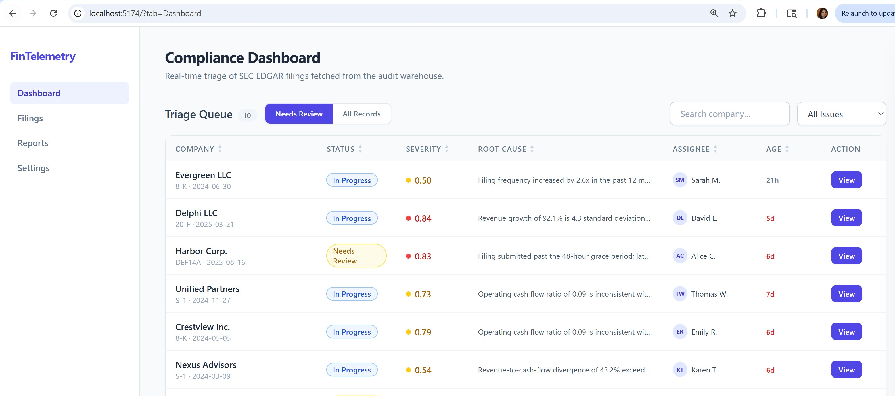
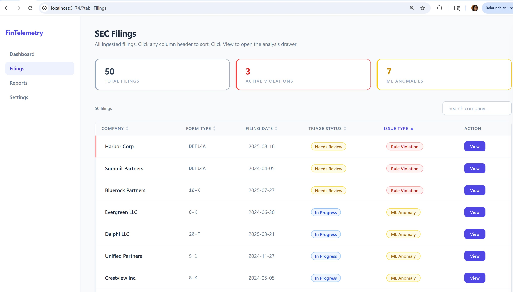
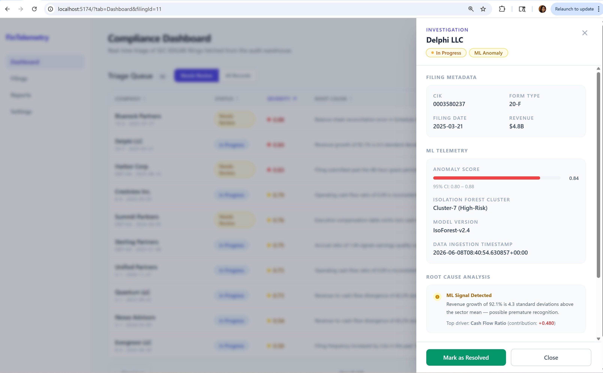
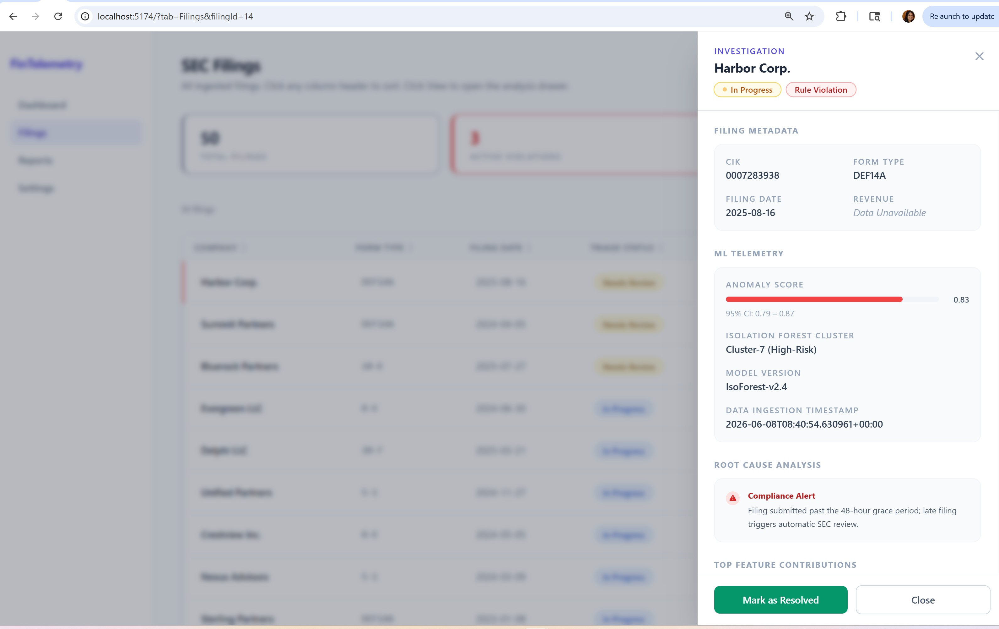

# Fin-Telemetry ML Pipeline

## 📖 Introduction
The **Fin-Telemetry ML Pipeline** is an enterprise-grade regulatory technology (RegTech) solution designed to ingest, clean, and analyze vast quantities of corporate financial data. By bridging the gap between raw public disclosures and actionable compliance intelligence, this project provides a scalable framework for detecting both "known" regulatory violations and "unknown" financial anomalies. 

Whether processing static datasets for testing or streaming live filings from the SEC EDGAR system, this project leverages professional data engineering practices to ensure data integrity, privacy, and auditability throughout the entire lifecycle.

## 🏗️ Production-to-Project Mapping
This project mirrors enterprise-grade regulatory pipelines. Below is how the production architecture maps to our local prototype:

| Production Phase | Enterprise Azure Stack | Local Prototype (Mock) | Local Prototype (Live) |
| :--- | :--- | :--- | :--- |
| **Orchestration** | Azure Data Factory | Python Script | Python Script / Cron |
| **Extract (Bronze)** | Azure Data Lake Storage | Static JSON Files | DuckDB / PySpark (Azure Blob) |
| **Transform (Silver)** | Azure Databricks | Pandas Processing | PySpark (Local CPU Cores) |
| **Load (Gold)** | Azure Synapse Analytics | SQLite | SQLite / DuckDB |
| **Visualization** | Power BI | React Dashboard | React + FastAPI |

## 🖥️ Local Environment & Ports
To maintain clean separation between development and production environments, the project utilizes distinct port assignments:

| Environment | Frontend Port | Backend (API) Port |
| :--- | :--- | :--- |
| **Mock Data** | `http://localhost:5174` | `http://localhost:8002` |
| **Live Pipeline** | `http://localhost:5175` | `http://localhost:8001` |

## 📸 Project Showcase

### Dashboard Overview

### Filings Overview

### ML Anomaly Investigation

### Compliance Rule Violation

## 🔍 Core Technology Stack
* **DuckDB**: An embedded, column-oriented database engine optimized for analytical queries. It allows for cloud-scale telemetry analysis directly within your Python environment without network overhead.
* **PySpark**: The official Python API for Apache Spark. It treats your laptop's CPU cores as independent worker nodes, enabling distributed data processing that is "enterprise-ready" for cloud scaling.
* **Pandas & Scikit-learn**:
    * **Pandas (Workbench)**: Used for data cleaning, filtering, and structural transformation.
    * **Scikit-learn (Analytical Engine)**: Used for running the **Isolation Forest** model to detect anomalies.

## 🧠 Machine Learning & Compliance
### Unsupervised Anomaly Detection
The project utilizes an **Isolation Forest** model—an unsupervised algorithm that isolates anomalies by "splitting" data. Unlike rule-based systems, it detects "unknown unknowns" by analyzing complex interactions across 15 financial metrics simultaneously.

### Deterministic Rule Violations
In addition to ML, the project enforces "hard" business rules (e.g., SOX 404 controls or filing deadlines) using deterministic logic like `if-then` statements.

### GDPR & PII Compliance
The pipeline enforces privacy through the **Transform (Silver)** phase:
* **Data Minimization**: Drops unnecessary personal metadata (names, emails) during ingestion.
* **Pseudonymization & Masking**: Sensitive identifiers required for audit (like executive signatures on Form 8-K) are hashed or masked before reaching the `audit_warehouse.db`.
* **Access Control**: Ensures the ReactJS dashboard only displays scrubbed data, preventing unauthorized PII exposure.

## 📂 SEC EDGAR Dataset
The system ingests data from the SEC's Electronic Data Gathering, Analysis, and Retrieval (EDGAR) system. This dataset provides the factual "paper trail" of corporate history, including:
* **Form 10-K**: Annual audited financial performance.
* **Form 10-Q**: Quarterly unaudited financial updates.
* **Form 8-K**: Real-time declarations of material events.